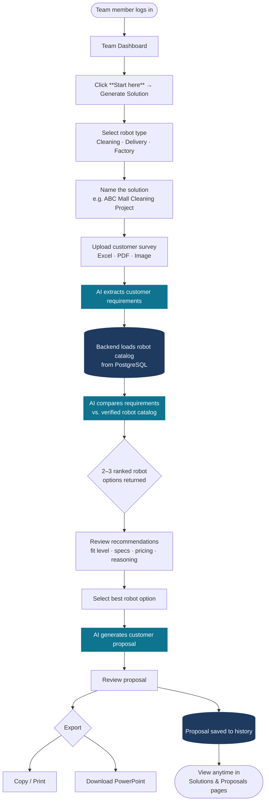

# RAASPAL — AI Robot Solution & Proposal Generator

An internal platform for the RAASPAL team to generate robot solution recommendations and customer proposals from uploaded survey forms — powered by Claude AI.

---

## Platform Workflow



> **Teal nodes** = AI steps &nbsp;|&nbsp; **Dark navy nodes** = Database operations &nbsp;|&nbsp; Everything else = User actions

---

## Tech Stack

| Layer | Technology |
|---|---|
| Backend API | Spring Boot 3.4.5 · Java 21 |
| Frontend | Next.js 16 · TypeScript · Tailwind CSS v4 |
| Database | PostgreSQL via Supabase (session-mode pooler) |
| Migrations | Flyway |
| AI Provider | Anthropic Claude API |
| Auth | JWT (Bearer token) |
| File Upload | Multipart — PDF, Excel, PNG, JPG |

**AI Models used:**
- Requirement extraction → `claude-sonnet-4-6`
- Robot recommendation → `claude-sonnet-4-6`
- Proposal generation → `claude-opus-4-8`

---

## Project Structure

```
AI-RobotRecommendationSystem-Backend/
├── src/main/java/com/raaspal/robotrecommendation/
│   ├── auth/            # JWT auth, login, user principal
│   ├── user/            # User entity & management
│   ├── robot/           # Robot catalog (entity, specs, import)
│   ├── requirement/     # Customer requirement extraction
│   ├── recommendation/  # AI recommendation engine
│   ├── proposal/        # Proposal generation & PPTX export
│   └── ai/              # Claude AI service (real + mock)
└── src/main/resources/
    ├── application.properties
    └── db/migration/    # Flyway SQL migrations (V1–V8)
```

---

## Running Locally

### Prerequisites

- Java 21
- Maven 3.9+
- PostgreSQL (or use the Supabase connection below)

### 1. Clone and configure

Create `src/main/resources/application-local.properties` (gitignored):

```properties
spring.datasource.url=jdbc:postgresql://<supabase-host>:5432/postgres?sslmode=require
spring.datasource.username=postgres.<project-ref>
spring.datasource.password=<your-password>

app.jwt.secret=<min-32-char-secret>

# Optional — leave blank to use MockAiService (hardcoded responses)
app.anthropic.api-key=sk-ant-...
```

### 2. Run

```bash
./mvnw spring-boot:run -Dspring-boot.run.profiles=local
```

The API starts on `http://localhost:8080`.

### 3. Run tests

```bash
./mvnw clean test
```

---

## Key API Endpoints

| Method | Endpoint | Description |
|---|---|---|
| `POST` | `/api/v1/auth/login` | Login, returns JWT |
| `POST` | `/api/v1/files/upload` | Upload customer survey file |
| `POST` | `/api/v1/requirements/extract-from-file/{fileId}` | AI extracts requirements |
| `POST` | `/api/v1/recommendations/generate/{requirementId}` | AI generates robot recommendations |
| `POST` | `/api/v1/proposals/generate` | AI generates customer proposal |
| `GET` | `/api/v1/proposals/{id}/export/pptx` | Download proposal as PowerPoint |
| `GET` | `/api/v1/robots` | List robot catalog |
| `GET` | `/api/v1/cvte/devices` | List/search tracked CVTE C3 devices (online/offline status) |
| `POST` | `/api/v1/cvte/devices/sync` | Search Kava by factory SN / device name / org code and start tracking matches |
| `POST` | `/api/v1/cvte/devices/poll-now` | Refresh status for every tracked CVTE device |
| `POST` | `/api/v1/cvte/devices/{deviceId}/poll-now` | Refresh status for a single tracked CVTE device |
| `GET` | `/api/v1/kpi/cm-cases?from=YYYY-MM&to=YYYY-MM` | RE KPI: CM cases, SLA and first-time fix per month and service line, from the synced monday tickets (ADMIN / RAASPAL_TEAM) |
| `POST` | `/api/v1/kpi/monday/sync` | Start a background sync of the Cleaning + Delivery Tickets boards into `case_ticket` (202; poll `/monday/sync/status`) |
| `GET` | `/api/v1/kpi/monday/sync/runs` | Sync history, newest first |
| `GET` | `/api/v1/kpi/monday/config` | Effective board/column mapping (never the token) |
| `GET` | `/api/v1/kpi/monday/boards/{boardId}` | Live column + group ids of a board, for writing the mapping |

All endpoints (except login) require `Authorization: Bearer <token>`.

---

## Environment Variables (Render / Production)

| Variable | Description |
|---|---|
| `DB_URL` | Supabase JDBC connection URL |
| `DB_USERNAME` | Supabase username |
| `DB_PASSWORD` | Supabase password |
| `JWT_SECRET` | Min 32-character secret for signing tokens |
| `ANTHROPIC_API_KEY` | Claude API key — omit to use MockAiService |
| `ANTHROPIC_MODEL` | Override extraction/recommendation model |
| `ANTHROPIC_PROPOSAL_MODEL` | Override proposal generation model |
| `CORS_ALLOWED_ORIGINS` | Comma-separated list of allowed frontend URLs |
| `FILE_UPLOAD_DIR` | Directory for uploaded survey files |
| `CVTE_KAVA_BASE_URL` | Base URL of the Kava Open Gateway API |
| `CVTE_KAVA_APP_ID` | Kava app ID (sent as `x-kv-app-id`) |
| `CVTE_KAVA_APP_SECRET` | Kava app secret — used only to compute request signatures, never logged or stored |
| `CVTE_KAVA_SIGN_TYPE` | Signing algorithm: `md5` or `hmac` (default `hmac`) |
| `CVTE_KAVA_POLLING_ENABLED` | `true` to enable background refresh of tracked devices (default `false`, manual sync/poll works either way) |
| `CVTE_KAVA_POLLING_INTERVAL_MS` | Interval between scheduled polls in milliseconds (default `60000`) |
| `MONDAY_API_TOKEN` | monday.com API token — needed by the CM-report preview and the RE KPI case sync |
| `KPI_MONDAY_SYNC_ENABLED` | `true` to run the nightly monday → `case_ticket` sync (default `false`; `POST /api/v1/kpi/monday/sync` works either way) |
| `KPI_MONDAY_SYNC_CRON` / `KPI_MONDAY_SYNC_ZONE` | When it runs (default `0 30 1 * * *` in `Asia/Bangkok`) |
| `KPI_REPEAT_WINDOW_DAYS` | Days after a ticket closes within which a new ticket for the same serial counts as a repeat (default `7`) |
| `APP_KPI_MONDAY_BOARDS_<n>_COLUMNS_<FIELD>` | Override a board's column mapping without a deploy, e.g. `APP_KPI_MONDAY_BOARDS_0_COLUMNS_CLOSEDATE=date_xxxx`; see the `app.kpi.monday` block in `application.properties` |

---

## CVTE C3 Online/Offline Status

A small, separate module ([[CvteDevice]], `com.raaspal.robotrecommendation.cvte.*`) tracks CVTE C3 robot
online/offline status via the Kava Open Gateway API. It does not touch the Robot/RobotSpec catalog.

To start tracking a device:

1. Set `CVTE_KAVA_BASE_URL`, `CVTE_KAVA_APP_ID`, and `CVTE_KAVA_APP_SECRET` (and optionally `CVTE_KAVA_SIGN_TYPE`).
2. Call `POST /api/v1/cvte/devices/sync` with any of `factorySn`, `deviceName`, or `orgCode` — the backend
   searches Kava and saves matching devices locally (deviceId, factory SN, name, online status, running
   state, battery %, last checked time, last API message).
3. Use `GET /api/v1/cvte/devices` to list/search tracked devices, or `POST /api/v1/cvte/devices/poll-now`
   (all devices) / `POST /api/v1/cvte/devices/{deviceId}/poll-now` (one device) to refresh their status on demand.
4. Set `CVTE_KAVA_POLLING_ENABLED=true` to additionally refresh tracked devices automatically in the background.

The frontend exposes this at **CVTE C3 Status** in the sidebar (`/cvte`), plus a compact summary on the
Team Dashboard, and only ever calls this Spring Boot backend — never the Kava API directly.

---

## AI Behaviour Rules

- AI only uses robot data provided by the backend from PostgreSQL — it never invents specs or prices.
- If information is missing, the AI marks it as **"Needs confirmation"**.
- Every proposal includes a note that final confirmation requires RAASPAL verification and/or a site survey.

---

## Deployed Services

| Service | URL |
|---|---|
| Backend API | https://ai-robotrecommendationsystem-backend.onrender.com |
| Frontend | *(Vercel — deploy pending)* |
