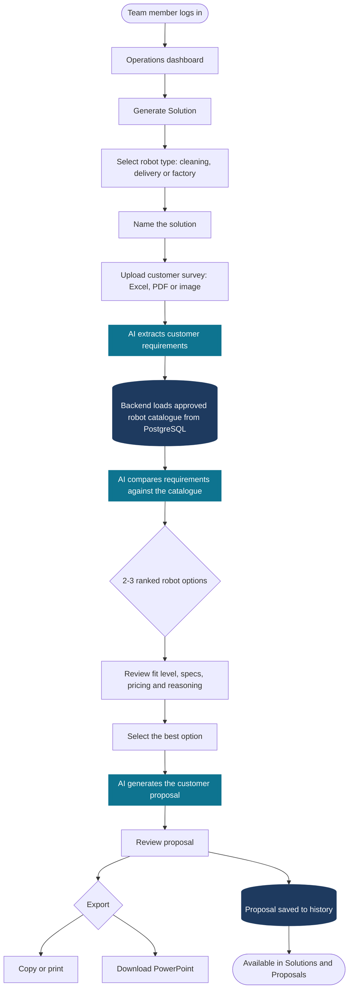

# RaasPal Internal Ops — Backend API

The Spring Boot service behind RaasPal's internal operations platform. It turns a
customer survey document into a costed robot proposal using AI, keeps a live picture of
the deployed robot fleet through vendor telemetry APIs, mails customers automated
performance reports, and runs the warehouse inventory the sales side quotes against.

One deployable application, hard internal module boundaries, serving two separate
Next.js frontends and a third-party partner API.

---

## Snapshot

| | |
|---|---|
| **Type** | Internal B2B platform backend — modular monolith |
| **Stack** | Java 21 · Spring Boot 3.4.5 · PostgreSQL · Flyway · Maven |
| **AI** | Anthropic Claude API — Sonnet for extraction and matching, Opus for proposal writing |
| **Auth** | JWT bearer tokens with role-based access; a separate OAuth-style token issuer for external partners |
| **Size** | 19 domain modules · 37 Flyway migrations · ~150-robot managed fleet |
| **Integrations** | Gausium telemetry · AutoXing telemetry · CVTE Kava Open Gateway · Monday.com · SMTP delivery |
| **Consumers** | Operations console (Next.js) · RIMS inventory app (Next.js) · partner API |
| **Hosting** | Docker on AWS Lightsail (Singapore) behind Nginx + Let's Encrypt; Supabase PostgreSQL |

---

## What it does

**Proposal generation.** A team member uploads a customer survey as Excel, PDF or an
image. Claude extracts the requirements into a structured record, the backend loads the
approved robot catalogue from PostgreSQL, and Claude ranks 2–3 candidate robots against
those requirements with a stated fit level and reasoning. Picking one generates a full
customer proposal, exportable as PowerPoint.

**Fleet telemetry.** Scheduled adapters pull operating data from Gausium and AutoXing
for every deployed unit, so cleaning hours, coverage and battery history are held
locally rather than re-queried per page load.

**Automated customer reporting.** Monthly and weekly performance reports are assembled
from stored telemetry, rendered for preview, and delivered by email on a schedule.
Customers open their report through a signed link without needing an account.

**CM (corrective maintenance) reports.** Field service records with captured engineer
signatures, written on site and exposed back to the customer.

**Robot inventory (RIMS).** Stock robots and spare parts, with an append-only stock
movement ledger — quantities change only by recording a movement, never by direct edit.

**Partner API.** A separately authenticated surface (`/api/partner/v1`) with its own
token issuer and signing secret, so an external partner system never holds staff
credentials.

**Device status.** CVTE C3 units are tracked for online/offline and battery state via
the Kava Open Gateway, isolated from the main robot catalogue.

---

## Platform workflow



Teal = AI steps · dark navy = database operations · everything else = user actions.

---

## Architecture

Each module owns its own tables, controllers and services. Foreign keys point *into*
shared entities but never out of them, so any module stays extractable into its own
service later without a schema rescue.

```
src/main/java/com/raaspal/robotrecommendation/
├── ai/              Claude client, prompt construction, real + mock implementations
├── auth/            Login, JWT issue and verify, security configuration
├── user/            Accounts and roles
├── customer/        Customer records
├── robot/           Approved robot catalogue, specifications, datasheet import
├── robotunit/       Individual physical units and their lifecycle status
├── requirement/     AI requirement extraction from uploaded surveys
├── recommendation/  AI robot matching and ranking
├── proposal/        Proposal generation, templates, PPTX export
├── file/            Multipart upload handling
├── telemetry/       Fleet telemetry core + Gausium and AutoXing adapters, schedulers
├── report/          Customer performance reports: assembly, preview, email delivery
├── cm/              Corrective maintenance reports with captured signatures
├── casereport/      Case reporting, Monday.com preview integration
├── inventory/       Stock robots, parts, append-only movement ledger
├── partner/         External partner API, own token issuer and security chain
├── cvte/            CVTE C3 device status via the Kava Open Gateway
├── translation/     Translation endpoint backing the bilingual frontend
└── common/          Shared enums and cross-cutting types
```

### Design decisions worth naming

- **Modular monolith over microservices.** Auth already exists once, the robot catalogue
  is the natural parent of the parts catalogue, and the whole platform serves a single
  internal team. Boundaries are enforced in the code rather than over the network.
- **AI is constrained, not trusted.** Claude only ever sees robot data the backend loaded
  from PostgreSQL, and is instructed never to invent a specification, price or capability.
- **Append-only stock ledger.** Inventory quantities are derived from movements, so every
  number on screen has an attributable history.
- **Mock AI by default.** With no API key configured the app runs against `MockAiService`,
  so the full flow is developable and testable without spending on tokens.

---

## Tech stack

| Layer | Technology |
|---|---|
| Language / runtime | Java 21 |
| Framework | Spring Boot 3.4.5 (Web, Data JPA, Security, Validation, Scheduling) |
| Database | PostgreSQL — Supabase, session-mode pooler |
| Migrations | Flyway (37 versioned migrations) |
| AI provider | Anthropic Claude API |
| Auth | JWT bearer tokens; separate secret and issuer for partner tokens |
| File upload | Multipart — PDF, Excel, PNG, JPG |
| Export | PowerPoint (PPTX) generation |
| Build | Maven |
| Container | Docker, fronted by Nginx |

**AI models**

| Task | Model |
|---|---|
| Requirement extraction | `claude-sonnet-4-6` |
| Robot recommendation | `claude-sonnet-4-6` |
| Proposal generation | `claude-opus-4-8` |

Both are overridable by environment variable.

---

## Roles

| Role | Access |
|---|---|
| `ADMIN` | Everything, including user management |
| `RAASPAL_TEAM` | Solutions, recommendations, proposals, reports |
| `INVENTORY_STAFF` | Stock robots and parts only — no proposal, recommendation or partner surface |
| `CUSTOMER` | Reserved for customer-facing access |

Partner systems authenticate on a separate chain entirely and hold no staff role.

---

## Running locally

### Prerequisites

- Java 21
- Maven 3.9+
- A PostgreSQL database

### 1. Configure

Create `src/main/resources/application-local.properties` — gitignored:

```properties
spring.datasource.url=jdbc:postgresql://<host>:5432/postgres?sslmode=require
spring.datasource.username=<username>
spring.datasource.password=<password>

app.jwt.secret=<min-32-char-secret>

# Optional. Leave blank to run against MockAiService instead of the real API.
app.anthropic.api-key=sk-ant-...
```

### 2. Run

```bash
./mvnw spring-boot:run -Dspring-boot.run.profiles=local
```

The API starts on `http://localhost:8080`.

### 3. Test

```bash
./mvnw clean test
```

Test suites cover auth, CM reports, CVTE, inventory, partner, reporting and telemetry.
Tests run against in-memory H2 with Flyway disabled, so migrations are validated against
a real PostgreSQL instance rather than by the test run.

---

## API surface

All endpoints require `Authorization: Bearer <token>` except login, the partner OAuth
exchange, and signed customer report links.

| Base path | Purpose |
|---|---|
| `/api/v1/auth` | Login, token issue, current user |
| `/api/v1/users` | Account management |
| `/api/v1/customers` | Customer records |
| `/api/v1/files` | Survey upload |
| `/api/v1/requirements` | AI requirement extraction |
| `/api/v1/recommendations` | AI robot recommendation |
| `/api/v1/proposals` | Proposal generation, history, PPTX export |
| `/api/v1/proposal-templates` | Proposal template management |
| `/api/v1/robots` | Approved robot catalogue |
| `/api/v1/robot-units` | Individual deployed units |
| `/api/v1/inventory` | Stock items and movements |
| `/api/v1/inventory/robot-stock` | Warehouse robot stock |
| `/api/v1/telemetry` | Fleet telemetry |
| `/api/v1/reports` | Customer report bundles, preview, email, signed links |
| `/api/v1/reports/delivery` | Scheduled delivery control |
| `/api/v1/reports/preview` | Report rendering preview |
| `/api/v1/autoxing/report` | AutoXing-sourced reporting |
| `/api/v1/cm-reports` | Corrective maintenance reports |
| `/api/v1/case-reports/monday` | Monday.com case preview |
| `/api/v1/cvte/devices` | CVTE C3 device tracking and polling |
| `/api/v1/translate` | Translation for the bilingual frontend |
| `/api/v1/ai` | Direct AI utility endpoints |
| `/api/v1/partners` | Partner administration (staff side) |
| `/api/partner/v1` | Partner-facing API |
| `/api/partner/v1/oauth` | Partner token exchange |

---

## Configuration

| Variable | Description |
|---|---|
| `DB_URL` | PostgreSQL JDBC connection URL |
| `DB_USERNAME` | Database username |
| `DB_PASSWORD` | Database password |
| `DB_POOL_MAX` | Maximum connection pool size |
| `JWT_SECRET` | Minimum 32-character secret for signing staff tokens |
| `PARTNER_JWT_SECRET` | Separate secret for partner tokens |
| `ANTHROPIC_API_KEY` | Claude API key — omit to use `MockAiService` |
| `ANTHROPIC_MODEL` | Override the extraction and recommendation model |
| `ANTHROPIC_PROPOSAL_MODEL` | Override the proposal generation model |
| `CORS_ALLOWED_ORIGINS` | Comma-separated list of allowed frontend origins |
| `FILE_UPLOAD_DIR` | Directory for uploaded survey files |
| `CVTE_KAVA_BASE_URL` | Kava Open Gateway base URL |
| `CVTE_KAVA_APP_ID` | Kava app ID, sent as `x-kv-app-id` |
| `CVTE_KAVA_APP_SECRET` | Kava app secret — used only to compute request signatures, never logged or stored |
| `CVTE_KAVA_SIGN_TYPE` | Signing algorithm, `md5` or `hmac` (default `hmac`) |
| `CVTE_KAVA_POLLING_ENABLED` | Enable background device refresh (default `false`) |
| `CVTE_KAVA_POLLING_INTERVAL_MS` | Scheduled poll interval (default `60000`) |
| `MONDAY_API_TOKEN` | monday.com API token for the pending-case reports. **Required** wherever those reports run: the default is empty, so without it the report reaches monday unauthenticated and fails |
| `MONDAY_API_VERSION` | monday.com API version (default `2026-07`). Pinned because unpinned requests roll forward each quarter |
| `MONDAY_UPDATES_PER_ITEM` | Comments read per ticket (default `50`). The Solution column is written from the whole thread |
| `CASE_REPORT_SYNC_ENABLED` | Daily snapshot of both boards, then freeze the day report (default `false`). A day it does not run cannot be reported on later |
| `CASE_REPORT_SYNC_CRON` | When that runs (default `0 15 6 * * *`, Asia/Bangkok) |
| `CASE_REPORT_METRO_PROVINCES` | Provinces on the 3-day SLA; everywhere else is 5 (default: the six greater-Bangkok provinces, in Thai and English) |

---

## AI behaviour rules

These are enforced in the prompts and are not optional:

- The AI uses **only** robot data supplied by the backend from PostgreSQL. It never
  invents specifications, prices, performance figures or features.
- Missing information is marked **"Needs confirmation"** rather than filled in.
- The AI explicitly lists what customer information is missing and what to ask.
- Every proposal states that final confirmation requires RaasPal verification and/or a
  site survey.
- Generated proposals follow the template's structure and tone without copying
  irrelevant template content.

---

## Deployment

Docker image fronted by Nginx with Let's Encrypt TLS, running on an AWS Lightsail
instance in Singapore, with Supabase PostgreSQL as the database. The API is served from
a product-neutral hostname because one backend now serves two distinct frontends.

Deployment assets live in `deploy/`.

### Operational notes

- **Schedulers must run in exactly one instance.** Two instances hitting the delivery
  cron in the same minute would double-send customer emails.
- **A committed migration is an applied migration.** Flyway checksums applied migrations
  and refuses to start on a mismatch, so a `V*.sql` file is never edited in place — a new
  migration is added instead.
- **Schema changes expand before they contract.** Add the column, deploy the code, then
  drop the old one, so a running instance never meets a schema it predates.
